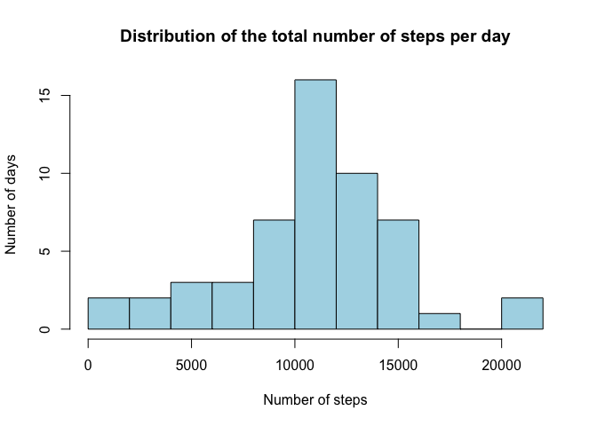
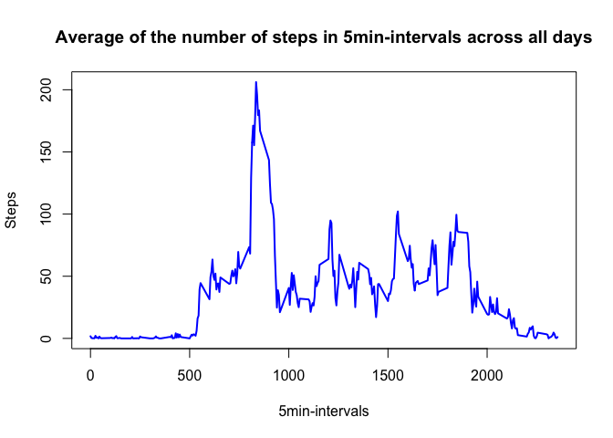
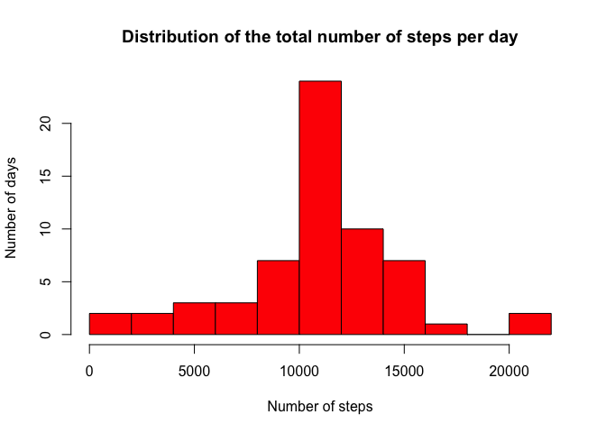
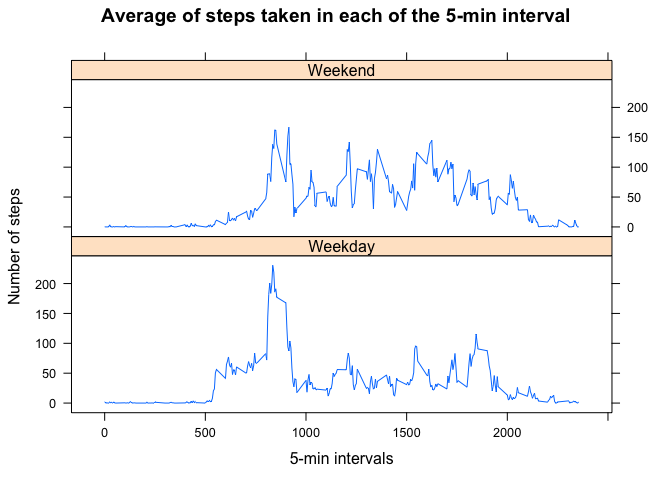

# Reproducible Research: Peer Assessment 1
Make sure to set your working directory where the file activity.csv is located

## Loading and preprocessing the data


```r
df<-read.csv("./activity.csv",colClasses = c("integer","Date","integer"))
```


## What is mean total number of steps taken per day?

1. Calculate the total number of steps taken per day

```r
stepsdays<-aggregate(steps~date,df,sum,na.rm=TRUE)
head(stepsdays)
```

```
##         date steps
## 1 2012-10-02   126
## 2 2012-10-03 11352
## 3 2012-10-04 12116
## 4 2012-10-05 13294
## 5 2012-10-06 15420
## 6 2012-10-07 11015
```

2. Make a histogram of the total number of steps taken each day


```r
hist(stepsdays$steps,breaks=10,col="lightblue",main="Distribution of the total number of steps per day",ylab="Number of days",xlab="Number of steps")
```

\

3. Calculate and report the mean and median of the total number of steps taken per day


```r
#Mean of total steps per day
print(mean(stepsdays$steps))
```

```
## [1] 10766.19
```

```r
#Median of total steps per day
print(median(stepsdays$steps))
```

```
## [1] 10765
```

## What is the average daily activity pattern?

1. Make a time series plot (i.e. 𝚝𝚢𝚙𝚎 = "𝚕") of the 5-minute interval (x-axis) and the average number of steps taken, averaged across all days (y-axis)


```r
meaninterv <- aggregate(steps~interval,df,mean,na.rm=TRUE)
plot(meaninterv,type="l",lwd=2,col="blue",xlab="5min-intervals",ylab="Steps",main="Average of the number of steps in 5min-intervals across all days")
```

\

2. Which 5-minute interval, on average across all the days in the dataset, contains the maximum number of steps?

```r
meaninterv[meaninterv$steps==max(meaninterv$steps),1]
```

```
## [1] 835
```
 
 The maximum number of steps occurs at the interval 835 which is hour 08:35 of the day

## Imputing missing values

1. Calculate and report the total number of missing values in the dataset (i.e. the total number of rows with 𝙽𝙰s)

The code bellow counts the number of missing values for each variable in the data set. Only the column "steps" contains missing values, being a total number of 2304 NAs observations


```r
sapply(df,function (x) sum(is.na(x)))
```

```
##    steps     date interval 
##     2304        0        0
```

2. Devise a strategy for filling in all of the missing values in the dataset

In order to impute values in the data set for the missing value, I checked which observations were missing values. There were 8 days missing values for all of the 5-min intervals measurements.
Thus, I will impute the average values for each of the 5-min interval calculated from the other days to imput into the days missing the values.


```r
df_missing<-df[is.na(df$steps),]
table(df_missing$date)
```

```
## 
## 2012-10-01 2012-10-08 2012-11-01 2012-11-04 2012-11-09 2012-11-10 
##        288        288        288        288        288        288 
## 2012-11-14 2012-11-30 
##        288        288
```

```r
head(table(df_missing$interval,df_missing$date))
```

```
##     
##      2012-10-01 2012-10-08 2012-11-01 2012-11-04 2012-11-09 2012-11-10
##   0           1          1          1          1          1          1
##   5           1          1          1          1          1          1
##   10          1          1          1          1          1          1
##   15          1          1          1          1          1          1
##   20          1          1          1          1          1          1
##   25          1          1          1          1          1          1
##     
##      2012-11-14 2012-11-30
##   0           1          1
##   5           1          1
##   10          1          1
##   15          1          1
##   20          1          1
##   25          1          1
```

3. Create a new dataset that is equal to the original dataset but with the missing data filled in.

Values were imputed with the average of each of the 5-min interval calculated from the other days


```r
#Create new dataset with imputed values from "meainterv" data frame created in question: 
#"What is the average daily activity pattern."

dfimput<-df
dfimput[is.na(dfimput)]<-meaninterv[,2]
```

4.Make a histogram of the total number of steps taken each day and Calculate and report the mean and median total number of steps taken per day.


```r
stepsdaysimput<-aggregate(steps~date,dfimput,sum,na.rm=TRUE)
hist(stepsdaysimput$steps,breaks=10,col="red",main="Distribution of the total number of steps per day",ylab="Number of days",xlab="Number of steps")
```

\

```r
print(mean(stepsdaysimput$steps))
```

```
## [1] 10766.19
```

```r
print(median(stepsdaysimput$steps))
```

```
## [1] 10766.19
```
Do these values differ from the estimates from the first part of the assignment? 

Yes, it changes but very sligthly. The median was 10765 and now is 10766.19, which is the same value as the old and the new mean.

What is the impact of imputing missing data on the estimates of the total daily number of steps?

Because the 8 days missing values now contains imputed data for each of the 5-min interval, which is equal to the average from the other 52 days, so there is an increase in the number of observations around the mean interval of the histogram. The shape of the histogram looks more "centralized"


## Are there differences in activity patterns between weekdays and weekends?

1. Create a new factor variable in the dataset with two levels – “weekday” and “weekend” indicating whether a given date is a weekday or weekend day


```r
dfimput$week<-ifelse (weekdays(dfimput$date)=="Saturday","Weekend",
                      ifelse(weekdays(dfimput$date)=="Sunday","Weekend","Weekday"))
head(dfimput)
```

```
##       steps       date interval    week
## 1 1.7169811 2012-10-01        0 Weekday
## 2 0.3396226 2012-10-01        5 Weekday
## 3 0.1320755 2012-10-01       10 Weekday
## 4 0.1509434 2012-10-01       15 Weekday
## 5 0.0754717 2012-10-01       20 Weekday
## 6 2.0943396 2012-10-01       25 Weekday
```

2. Make a panel plot containing a time series plot (i.e. 𝚝𝚢𝚙𝚎 = "𝚕") of the 5-minute interval (x-axis) and the average number of steps taken, averaged across all weekday days or weekend days (y-axis). 


```r
library(lattice)
meanintervimput <- aggregate(steps~interval+week,dfimput,mean,na.rm=TRUE)
xyplot(steps~interval|week,data=meanintervimput,type="l",layout=c(1,2),xlab="5-min intervals",ylab="Number of steps",main="Average of steps taken in each of the 5-min interval")
```

\


